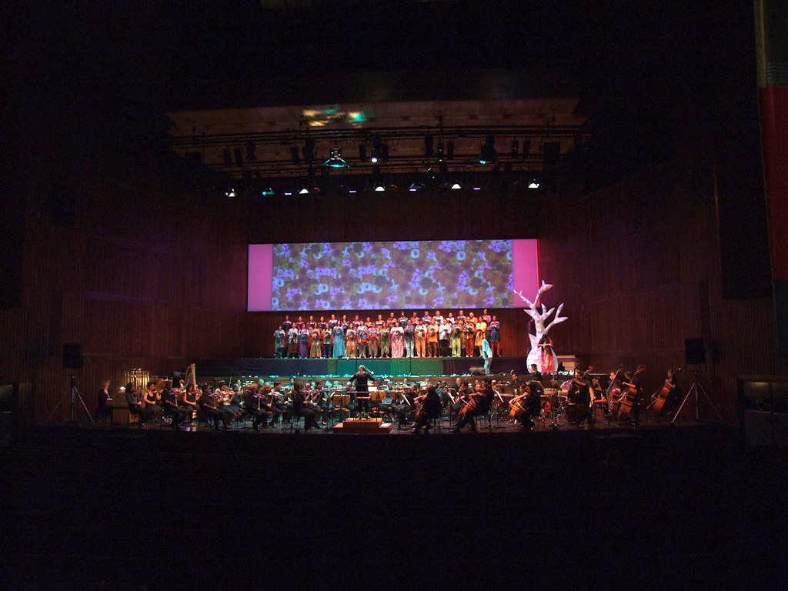
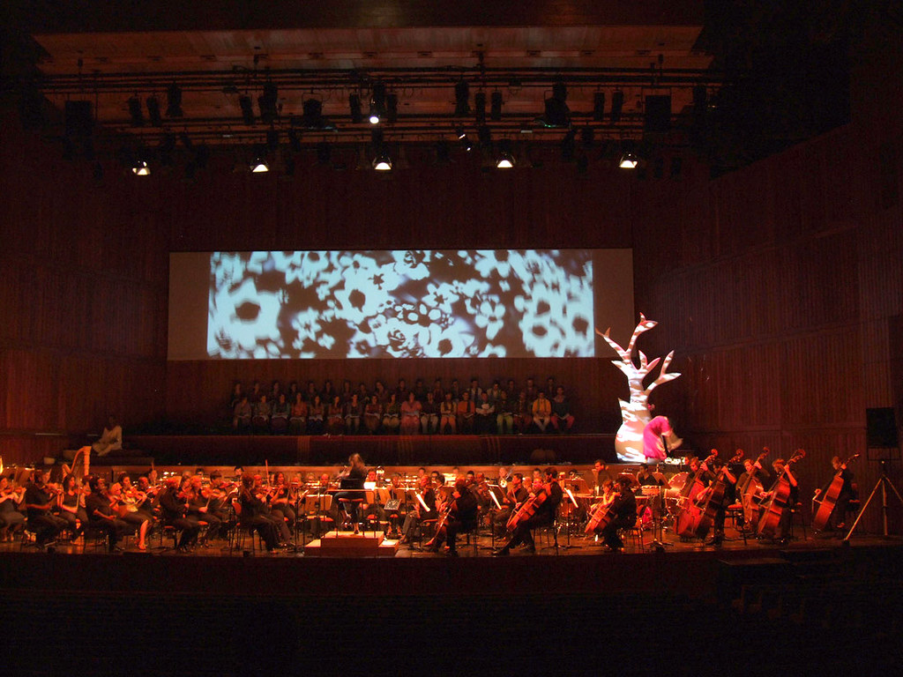
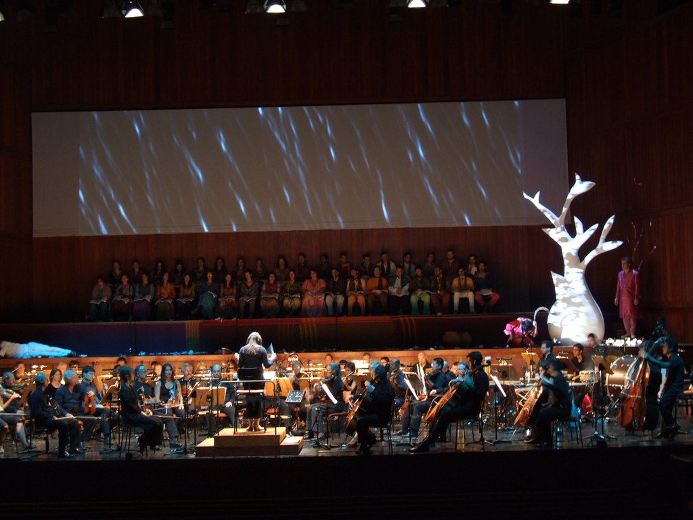
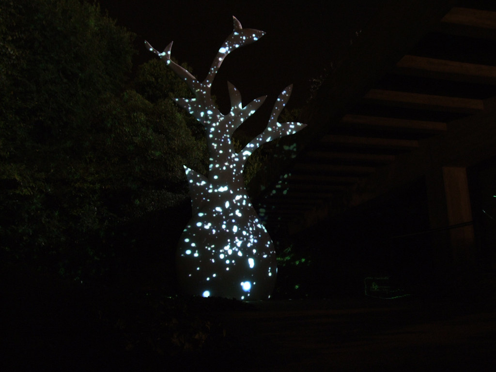
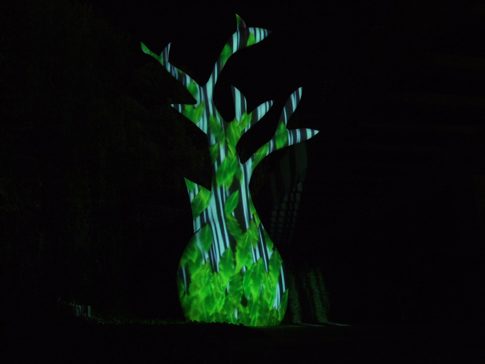
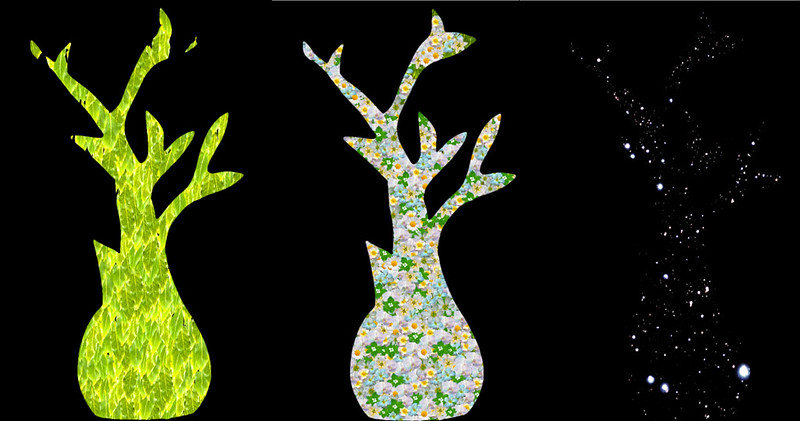
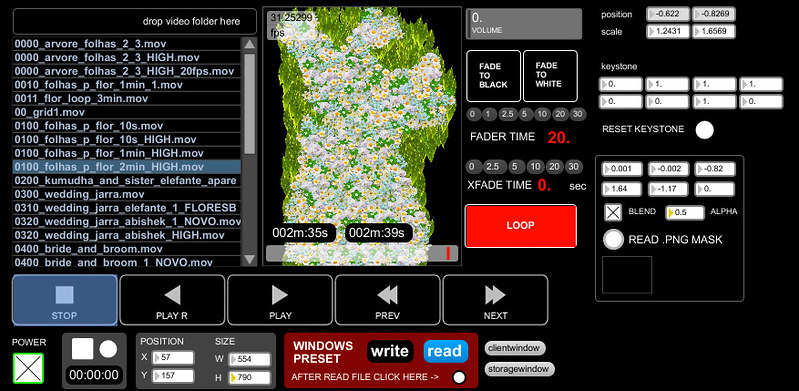

+++
title = "Flowering Tree, by John Adams"
date = 2010-09-13
lastUpdate = 0
tags = ["stage", "visuals", "work"]
featured = true
cover = "Flowering-Tree-8.jpg"
showCover = false
+++

A Flowering Tree by John Adams, inspired by Mozart’s Magic Flute. This performance, previously presented in March at Cité de la Musique in Paris, in the context of a festival dedicated to John Adams, and conducted by Joana Carneiro, in Lisbon will involve the scenic intervention of Rui Horta. ´
  
Coro **Gulbenkian  
**Orquestra **Gulbenkian  
**Maestrina **Joana Carneiro  
**Soprano **Ana Maria Pinto  
**Tenor **Noah Stewart  
**Barítono **Job Tomé  
**Concepção Cénica, Direcção de Actores **Rui Horta  
**Vídeo **Guilherme Martins**

