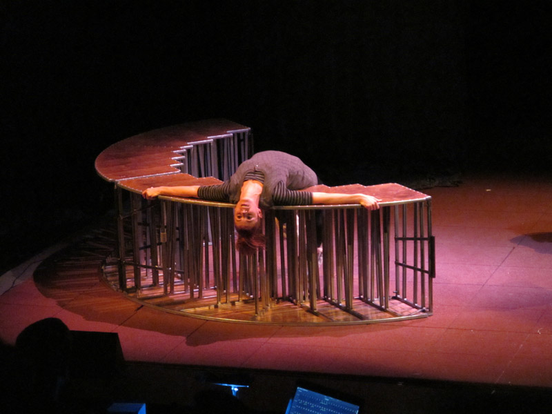
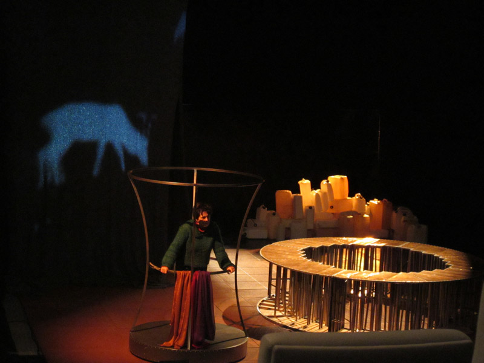
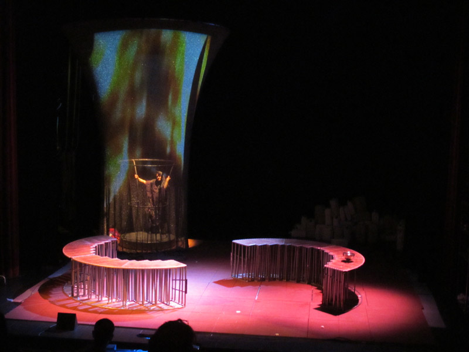
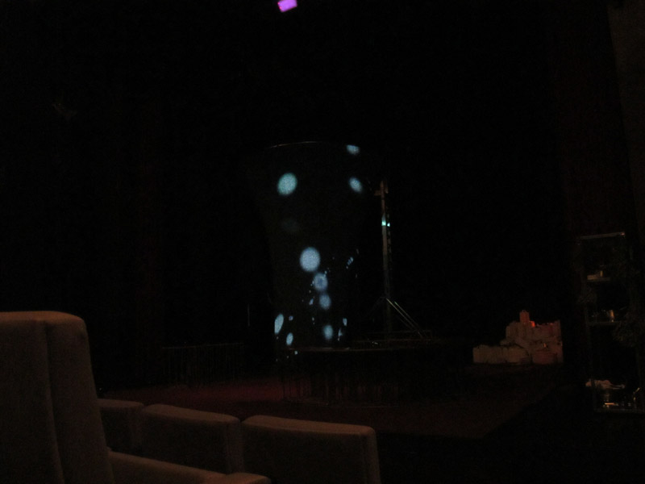

+++
title = "Pedro e Inês"
date = 2011-03-03
status = "archived"
tags = ["artica", "stage", "visuals", "work"]
featured = true
cover = "pedroines.jpg"
showCover = false
+++

◆

Pretendendo revisitar e reinventar a história de Pedro e Inês e partindo do texto inédito Inês Morre, de Miguel Jesus – o qual caminha progressivamente dum registo dramático e realista para o poético e para o metafórico – o Teatro O Bando convidou Anatoly Praudin, Director do Experimental Stage of Baltic House, em S. Petersburgo, a criar um espectáculo onde a sua visão externa, profundamente influenciada pela tradição teatral russa, pudesse levantar novas inquietações sobre esta lenda e espalhar uma nova luz sobre este mito. Só no mito conhecemos o que se esconde da História. Só no mito vemos a paixão crescer para lá deste mundo. Só no mito sentimos a culpa e a vingança dos que vivem e morrem. Só no mito ouvimos os coros que ecoam os sons da loucura. Só no mito bebemos o vinho escarlate que tem o gosto do sangue. Só no mito gritamos a nossa voz de povo rude e impune.  
_  
**(sinopse do espectáculo)  
**_Diz-nos, diz-nos, ó história esquecida  
Quem compra com a morte o que paga com a vida  
Diz-nos, diz-nos, ó cidade demente  
Qual o sangue culpado, qual o sangue inocente  
Diz-nos, diz-nos, ó pátria maldita  
Quanto sangue em ti chora, quanto sangue em ti grita  
Diz-nos, diz-nos, ó terra tão santa  
Quanta morte em ti grita, quanta morte em ti canta  
Diz-nos, diz-nos, ó vil escuridão  
Se trazes a morte na voz, se trazes a morte na mão  
Diz-nos, diz-nos, ó sombra vizinha  
Quem só depois de ser morta conseguiu ser rainha  
Diz-nos, diz-nos, ó história esquecida  
Quem compra com a morte o que paga com a vida  
  
Estreia | 11 de Março de 2011 no Centro Cultural e de Congressos das Caldas da Rainha  
Texto Miguel Jesus | Encenação Anatoly Praudin  
Coordenação Artística João Brites | Composição Musical Jorge Salgueiro  
Espaço Cénico Rui Francisco | Figurinos e Adereços Clara Bento  
Desenho de Luz João Cachulo | Vídeo Artica (André Almeida e Guilherme Martins)  
Apoio à Dramaturgia Odette Bereska | Assistência à Direcção Artística João Neca  
Interpretação Estêvão Antunes, Helena Afonso, Horácio Manuel, Ivo Alexandre, Miguel Borges, Sara de Castro, Susana Blazer

