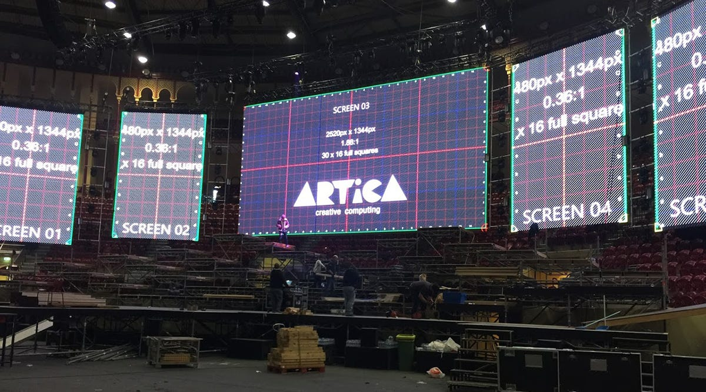
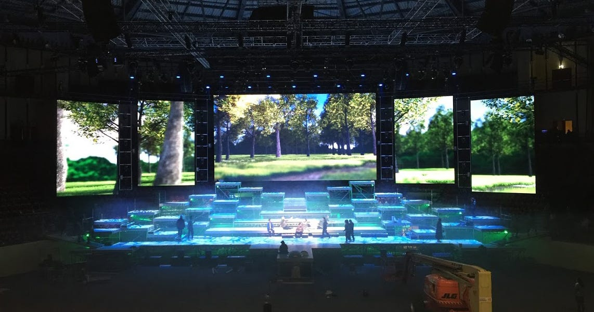
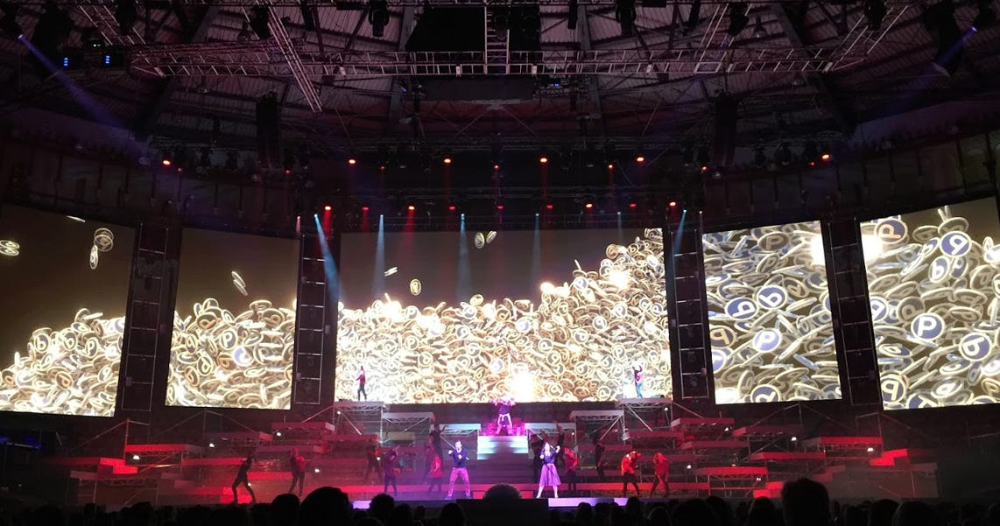

+++
title = "Popota Xmas"
date = 2018-09-17
status = "archived"
tags = ["artica", "stage", "visuals", "work"]
featured = true
cover = "popota.jpg"
showCover = false
+++

In 2017 we were invited by [UAU](http://www.uau.pt/) to participate in Popota’s Christmas Show, that took place in [Campo Pequeno](http://www.campopequeno.com/espetaculoseeventos/), Lisbon.

It was a big challenge due to the requirements of the performance:

- Ultra-Large LED Wall
- 40 minutes of continuous video
- Videos triggered in sync with the actors/performers
- Real-time interactive contents

Having this, we created all the visual contents plus the scene props.

The visuals were created 3D Max, edited and rendered in Unity 3D, then post-processed. Real-time interactive graphics generation was also developed in Unity 3D.

During the creative process, we wanted to have a glimpse of the size relations between the screens and the stage, so we developed a VR stage.

Our [Einstein VideoPlayer](http://artica.cc/products/#einstein) had to be updated to run large video dimensions with high performance, to achieve this peak performance we used [HAP codec](http://hap.video/). Einstein also received real-time video from a computer vision server running [Bonsai](https://bonsai-rx.org/) linked to Unity, and finally connected to a Spout server (if you are a MAC user, [Syphon](http://syphon.v002.info/) does the same job), using HAP also allowed us to use multi-layered contents with alpha transparency videos.

This is an image of the two control screens, the left screen is showing an infra-red camera image being analysed in Bonsai, the right screen is our EinsteinVP.

We also created the props, this included a big school rubber, pencils, compass, pencil sharpener and a gramophone.

Popota is a SonaeSierra’s brand.

**Visual Art Direction:**  
Guilherme Martins

**3D Modeling:**  
Filipe Barbosa

**Video Creation:**  
Guilherme Martins, Filipe Barbosa, João Ribeiro

**Software Development, Realtime Interaction:**  
André Almeida, Gonçalo Lopes, Ricardo Imperial

**Software Development, Einstein Video Player:**  
Guilherme Martins

**Props Concept and Direction:**  
Eric Costa

**Props Construction:**  
Eric Costa, José Noronha, Paula Espanha
