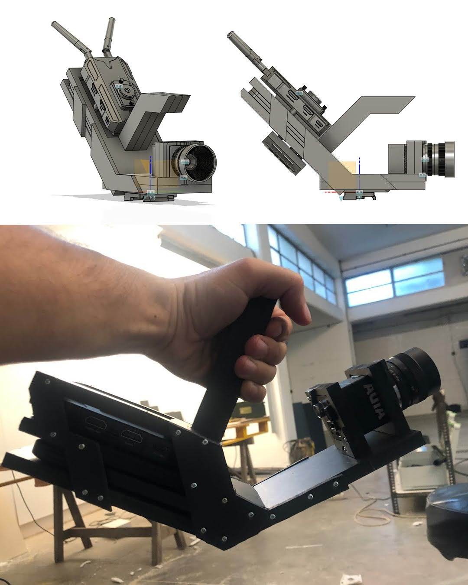
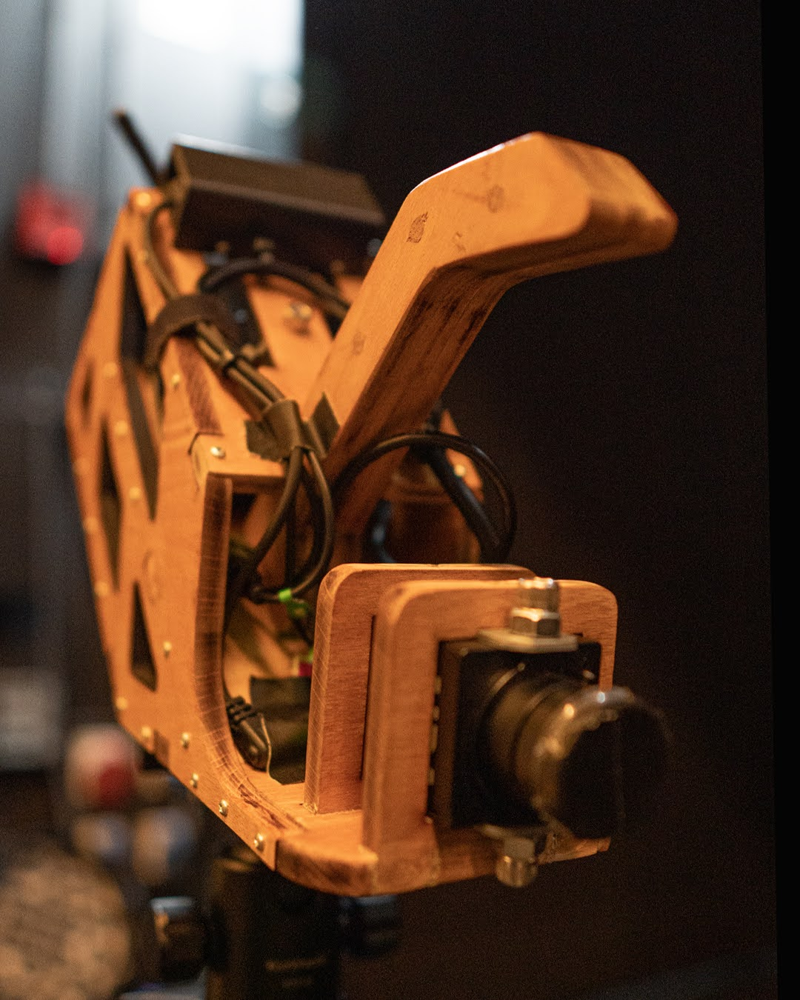
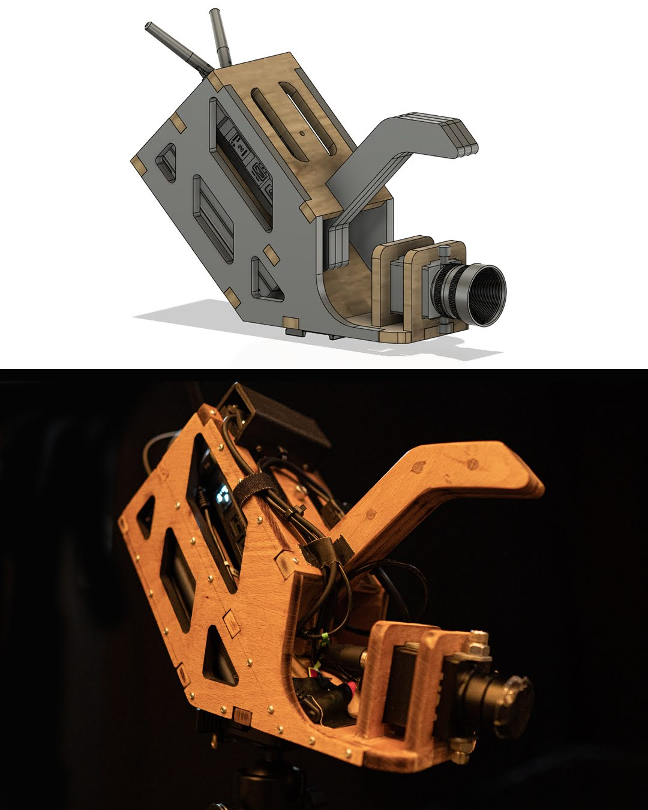
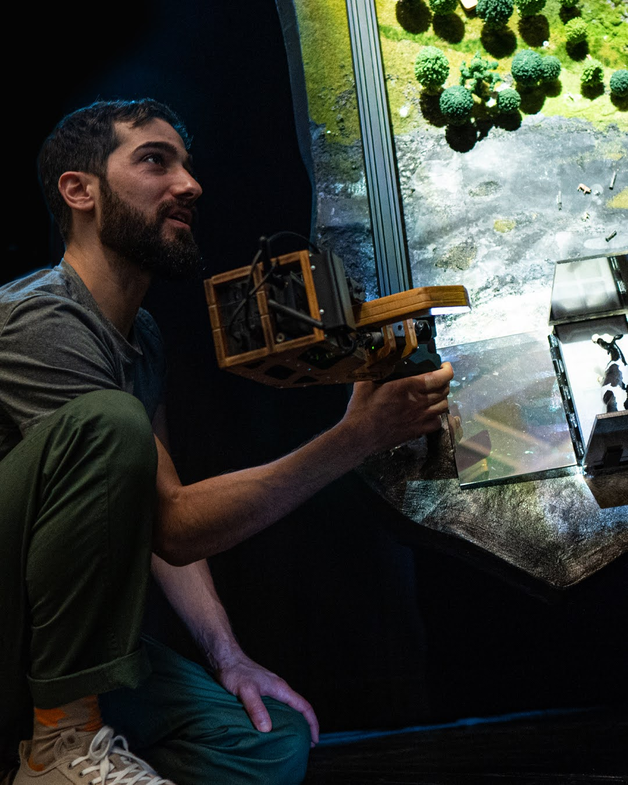
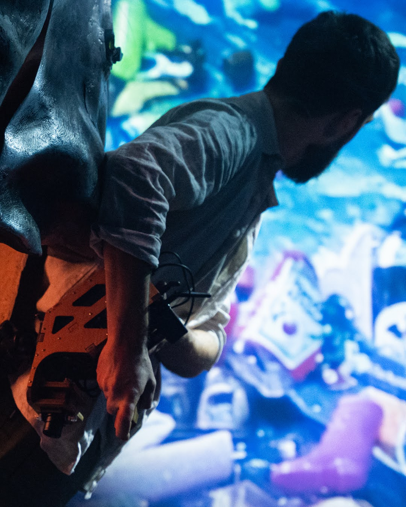
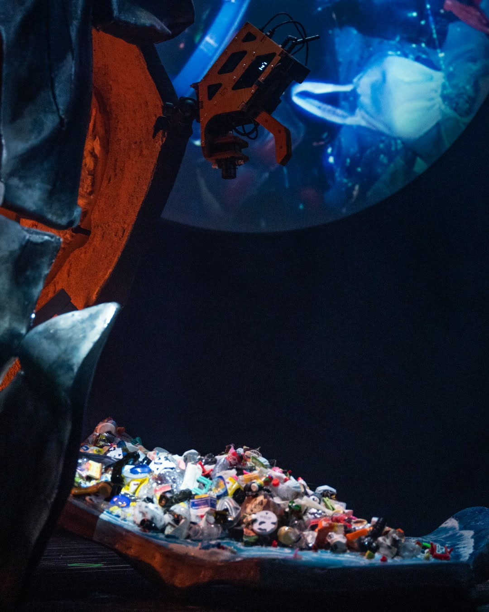

+++
title = "O Estado do Mundo"
date = 2021-12-02
status = "archived"
tags = ["stage"]
featured = true
cover = "oestadodomundo-1.jpg"
showCover = false
+++

O Estado do Mundo (Quando Acordas) is a play that brings awareness about climate change, consumerism, pollution, toxic waste, and so much more. All this subjects are approached in such a clever way due to the rich presentation by Edi and text by Inês and Miguel. All this comes to place with the genious scenography by Eric da Costa. Eric asked me to help him to develop a custom cage for the video camera. This device had to hold a camera, an hdmi transmissor and powerbanks. I started to prototype this concept following Eric's vision, and for this I used PVC foam, it allows to quickly prototype and test different approaches just with an x-acto knife.

After all the testing and several design iterations, the final object was laser cut using Beech wood (Faia).

 
 
 

 
 

**Encenação** Miguel Fragata 

**Texto** Inês Barahona e Miguel Fragata 

**Interpretação** Edi Gaspar 

**Cenografia** Eric da Costa 

**Figurinos** José António Tenente 

**Música** original Fernando Mota 

**Desenho de Luz** José Álvaro Correia 

**Vídeo** João Gambino 

**Adereços** Eric da Costa, José Pedro Sousa, Mariana Fonseca e Rita Vieira (design gráfico) 

**Maker** Guilherme Martins 

**Construção de cenografia** Gate7 

**Direção** técnica Renato Marinho 

**Consultoria** Henrique Frazão 

**Produção executiva** Ana Lobato e Luna Rebelo 

**Produção** Formiga Atómica 

**Co-produção LU.CA** – Teatro Luís de Camões, Comédias do Minho, Materiais Diversos e Théâtre de la Ville 

**Agradecimentos** Ana Pereira, Andreia Luís, Beatriz Castanheira, Carlos Félix/Decolab, Carlos Miguel/IMPERSOL, Dalila Romão, David Palma, Dina Mendonça, Elisabete Pinto, Joana Ascensão, João Ribeiro, Lara Soares, Maria Mestre, Mónica Talina, Paulo Teixeira/Fablab EDP, Raquel Castro, Rita Conduto, Susana Gaspar A Formiga Atómica é uma estrutura apoiada pelo Ministério da Cultura / Direcção-Geral das Artes.
