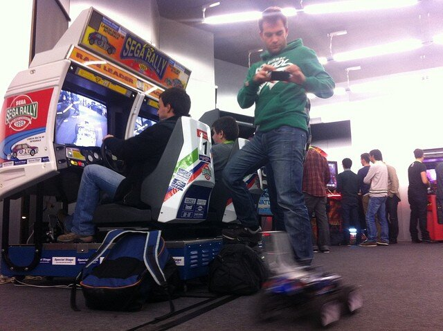

+++
title = "Sega Rally Mega Hack"
date = 2012-11-15
lastUpdate = 0
status = "archived"
tags = ["artica", "interactive", "physicalcomputing", "research", "work"]
featured = true
cover = "sega_rally.jpg"
showCover = false
+++


◆


Sega Rally Arcade Epic Hack  
Comissioned by Sapo, PT  
  
Premiere:  
Sapo Codebits VI  
Pavilhão Atlântico, 15 – 17 November 2012  
Also present at:  
MEO XL Party  
15 – 17 December 2012  
  
Concept   
ArticaCC (Guilherme Martins, André Almeida)  
  
Hack  
Guilherme Martins (Electronics, Cars Mechanics, Arcade Mod)  
André Almeida (Electronics, Arcade Mod)  
Luis Sobral (The Arcade Men, Arcade master)  
Maurício Martins (Leds & Chips, Electronics)  
João Ribeiro (Intern)

[Project full disclosure](https://medium.com/artica/sega-rally-championship-codebits-vi-74fcb3d1b219)

