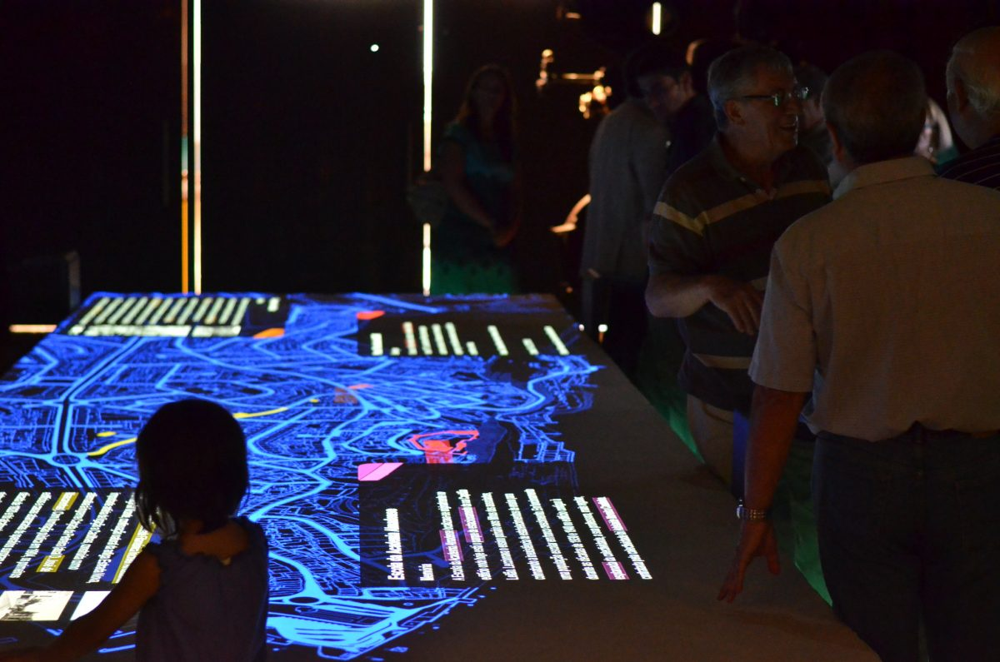

+++
title = "Ciav - Centro de Interpretação de Almada Velha"
date = 2013-07-15
lastUpdate = 0
status = "archived"
tags = ["artica", "interactive", "physicalcomputing", "work"]
featured = true
cover = "./2013-07-15-Ciav---Centro-de-Interpretacao-de-Almada-Velha-images/ciav-1.jpg"
showCover = false
+++


◆

CIAV . Centro de Interpretação de Almada Velha  
Comissioned by Câmara Municipal de Almada  

Concept  
ArticaCC (Guilherme Martins, André Almeida)  
RPAR (Ana Robalo, Rui Pinto)  
Eric da Costa

Architecture RPAR  
Ana Robalo  
Rui Pinto

Development ARTICACC  
André Almeida (Project Manager, Development)Guilherme Martins (Visual Design, Interactive Applications, Development)  
Filipe Cruz (Software Development)  
João Ribeiro (Construction)  
  
Scenography, Furniture Design   
Eric da Costa  
  
Graphic Design  
António Lobo  
  
Construction  
Leonel & Bicho  
  
[Project full disclosure](https://medium.com/artica/ciav-tech-report-62f72650c698)

