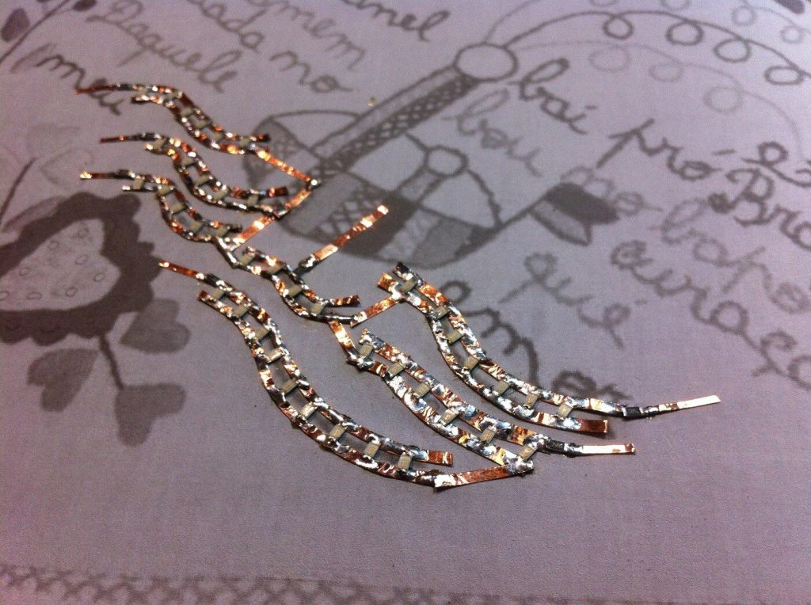
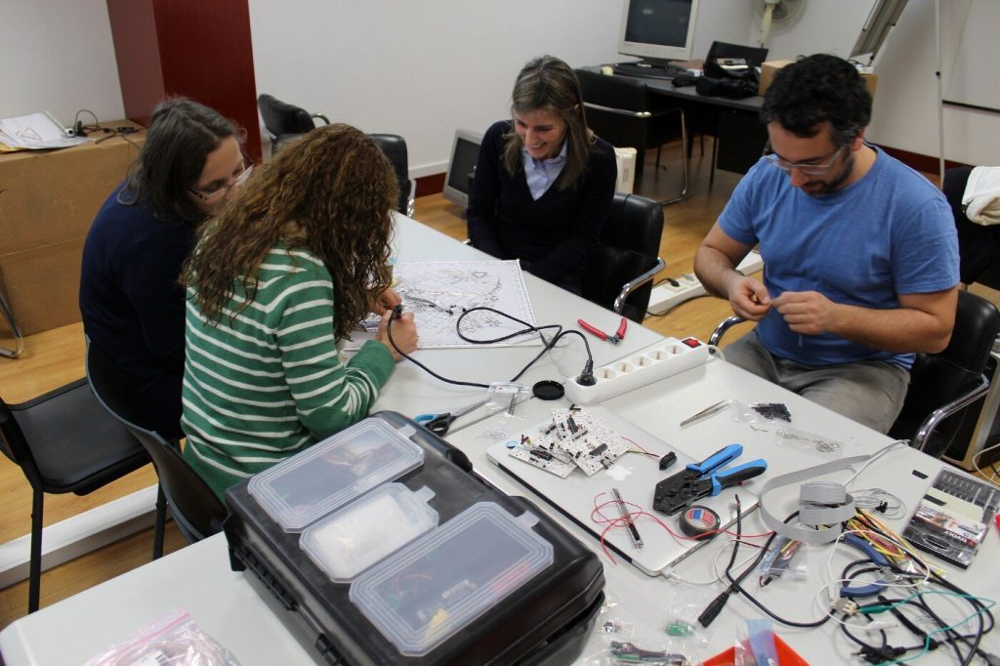
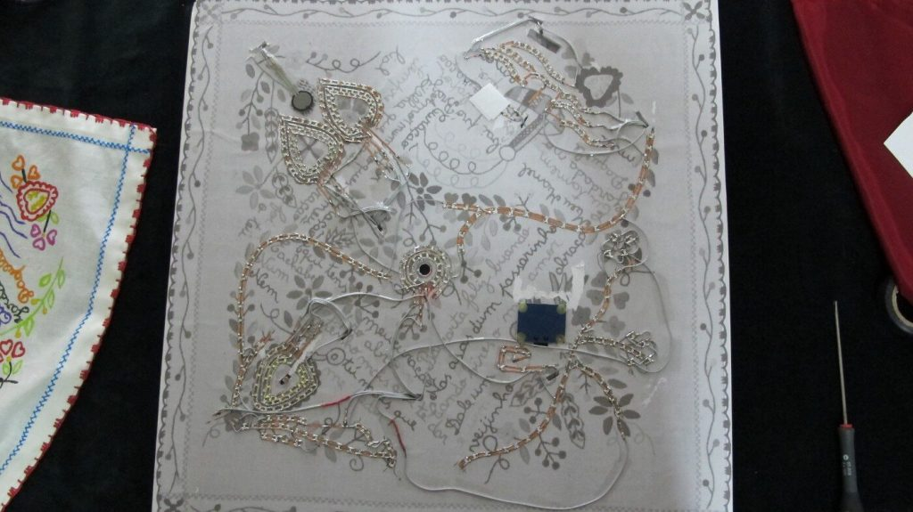
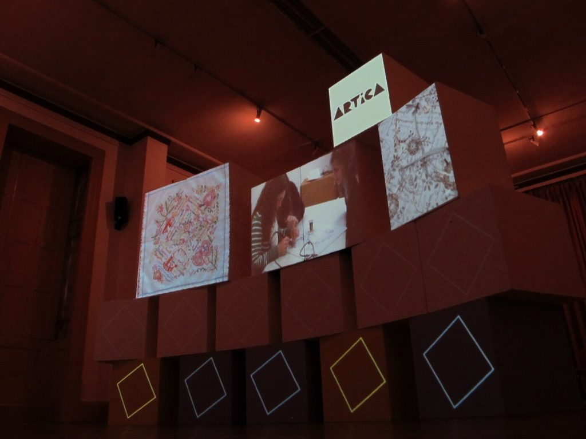

+++
title = "Valentine’s Interactive Hanky"
date = 2014-02-13
lastUpdate = 0
status = "archived"
tags = ["artica", "interactive", "physicalcomputing", "research", "work", "workshops"]
featured = true
cover = "interactive_valentine.jpg"
showCover = false
+++


◆

It all started with the idea of creating a workshop around the theme of paper circuits, with great inspiration from the work and research of [Jie Qui](https://vimeo.com/user1892233), [Liza Stark](http://lizastark.com/portfolio/paper-circuits/) and others. Above all, the main idea was to transfer skills and knowledge to the team at [Casa do Conhecimento](http://www.casadoconhecimento.pt/). To show how easy it is to create simple things that are both beautiful and can have a great impact. We had this initial idea but we were still lacking a concept on the same level to the technology. The workshop was planned for February, which coincided with the [Namorar Portugal](http://www.namorarportugal.pt/) (Flirting Portugal) event and all the Valentine happenings, and being Vila Verde the capital of this event we decided to combine the paper circuits workshop with the famous and acclaimed Lenço dos Namorados (Valentine’s handkerchief).

And so it was born the idea of transforming a traditional Valentine’s handkerchief into an interactive object, using different sensors, SMD coloured LEDs, Arduinos and copper tape.

The handkerchief we used was replicated using volume inks to avoid using the original cloth handkerchief.

)

The circuit was created with a 1:1 printed version.

)

As it evolved, it became a kind of work that resembled the craftsmanship of jewellery and [filigree](https://en.wikipedia.org/wiki/Filigree), an old very acclaimed Portuguese traditional craft.

After demystifying the process of placing the copper tape and soldering the LEDs, the folks from Casa do Conhecimento were able to finish the circuit on their own while Guilherme prepared the Arduino connections.

The circuit completed. We can see on the top left corner a pressure sensor, depending on how hard it is pressed the hearts pulsate with higher or lower intensity. On the right corner, there is a hidden infrared proximity sensor, when the hand approaches the sensor the sea waves light up in sequence. In the centre there is a microphone, the blowing intensity lights the stems and flowers. On the lower left corner, there is an LDR sensor which makes the heart LEDs react to changes in luminosity. Finally, on the lower right corner we have a capacitive sensor, touching it with a finger makes the letter light up and triggers on a small speaker the sound of a little bird.

For each of these sensor and actuator systems, we used a Motoruino (our very own Arduino clone). You can see the wiring mess underneath, with such a tight deadline there was no time to arrange the backstage properly.

Back to Valentine’s handkerchief, the setup was already completed so all there was left was to showcase it to the councillor Júlia Fernandes and journalists.

To accomplish the video mapping, nothing better than to use our very own [Einstein VideoPlayer](https://artica.cc/einstein/), which, with a few simple modifications, enabled us to project independent videos to multiple projection areas.

The event ended with a great surprise, it was offered an original Valentine’s handkerchief and a documentary book with all the handkerchief’s history and photos. Dozens of different handkerchiefs, all of them wonderful.

It was an epic event! The involvement of all the team behind Casa do Conhecimento, the sharing, the making, the joint creation of an object with immense potential.

Here are some clips from local newspapers online [Terras do Homem](http://www.terrasdohomem.com/pagina/seccao/17/noticia/13110) and [O Vilar Verdense](http://www.ovilaverdense.com/noticia.php?n=7629).
