+++
title = "Modular Physical Computing"
date = 2021-10-01
lastUpdate = 0
status = "archived"
tags = ["interactive", "physicalcomputing", "research", "workshops"]
featured = true
cover = "modular_physical_computing.jpg"
showCover = false
+++

## I personally enjoy pressing buttons, turning knobs,  see and touch physical devices, and if they make any bleep or bloops it's even better.  

Building physical control systems is not always easy, speccially if we need them to be sturdy enough to throw on a backpack, or take them to an installation or stage performance. This project started in [ArticaCC](http://artica.cc), during a research project named "Interact". This enabled us to research ways to build interactive systems related to software and hardware. These modular systems are easy to solder and easy to interface with, and because they are totally generic they can be used with [Arduino](http://arduino.cc), [Teensy](http://pjrc.com), [RaspberyPI](https://www.raspberrypi.org/) or any other microcontroller of your choice.

All these modules have an open source hardware philosophy and have a dedicated repository on [Github](https://github.com/articainstruments). Feel free to use them as you wish.

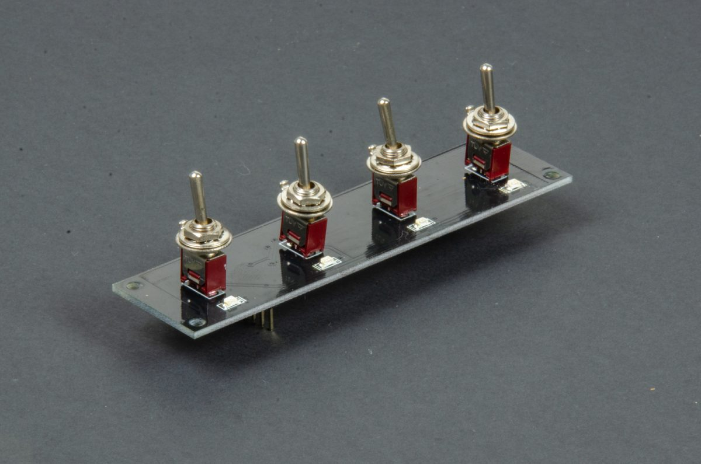
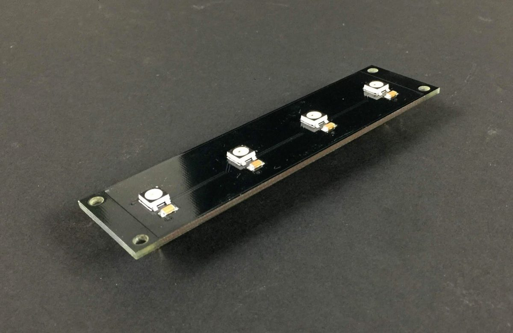
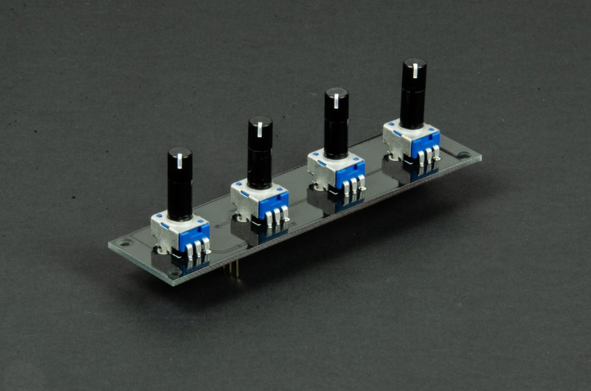
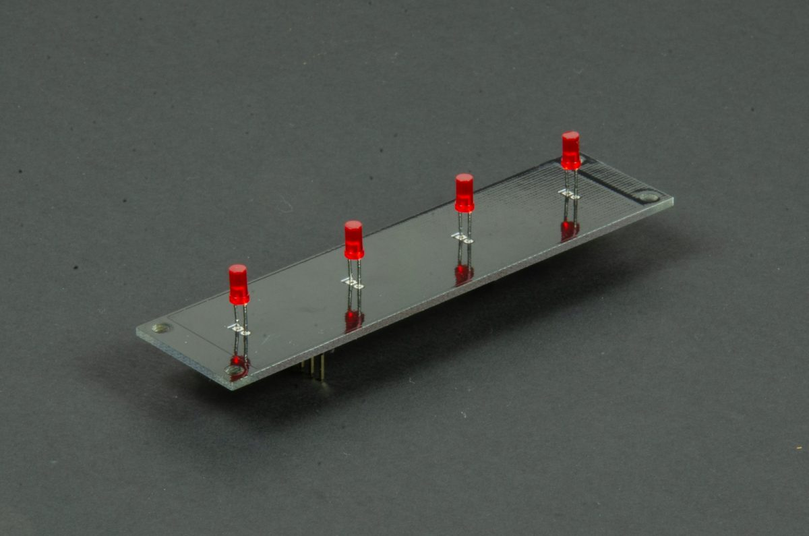
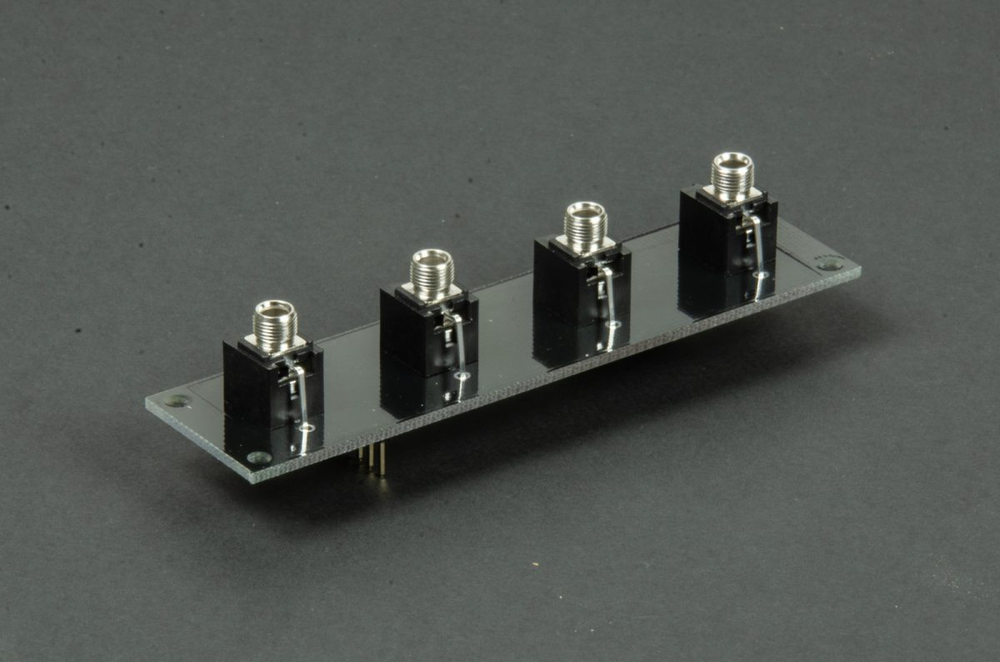
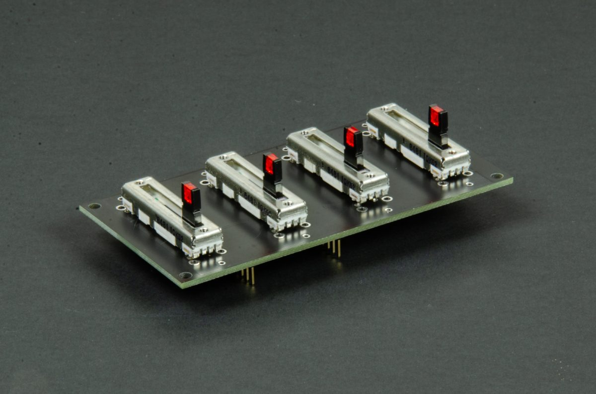
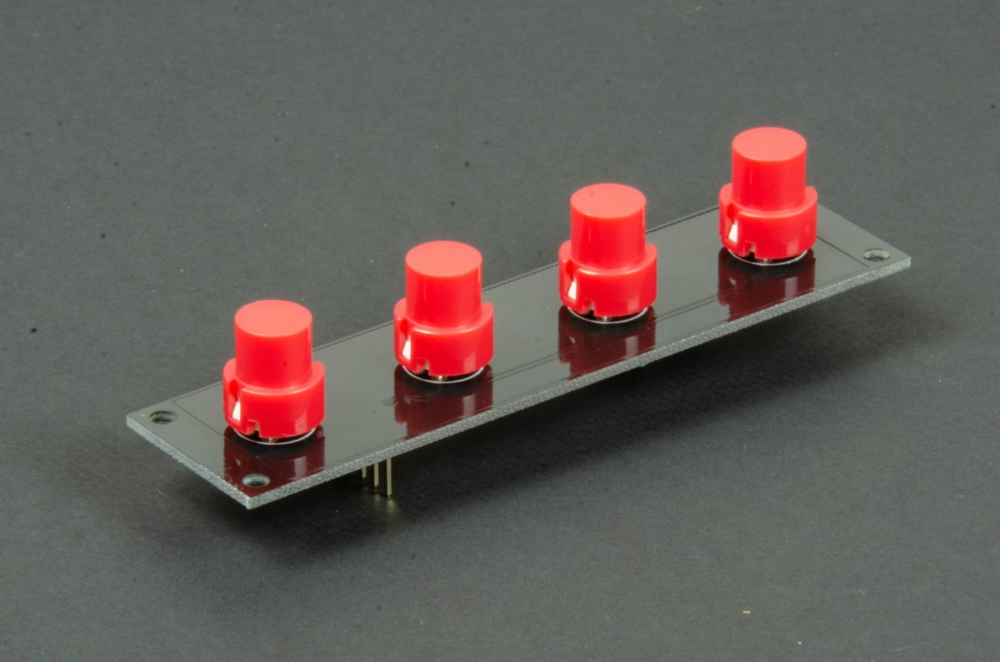

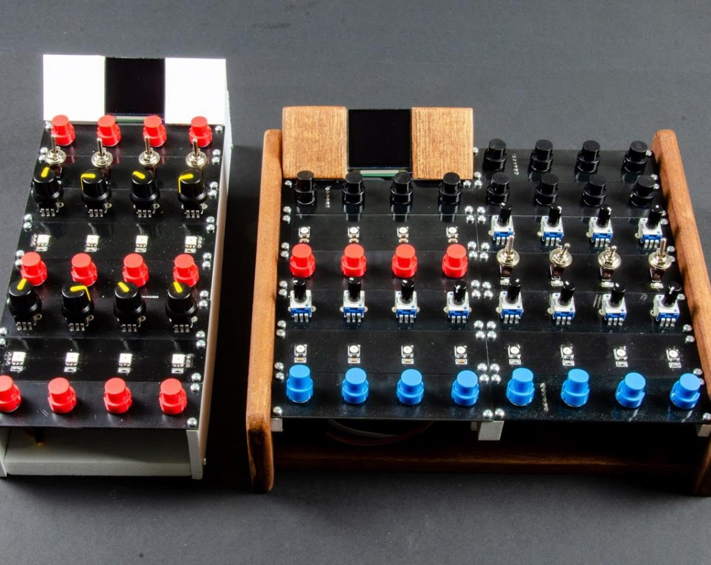

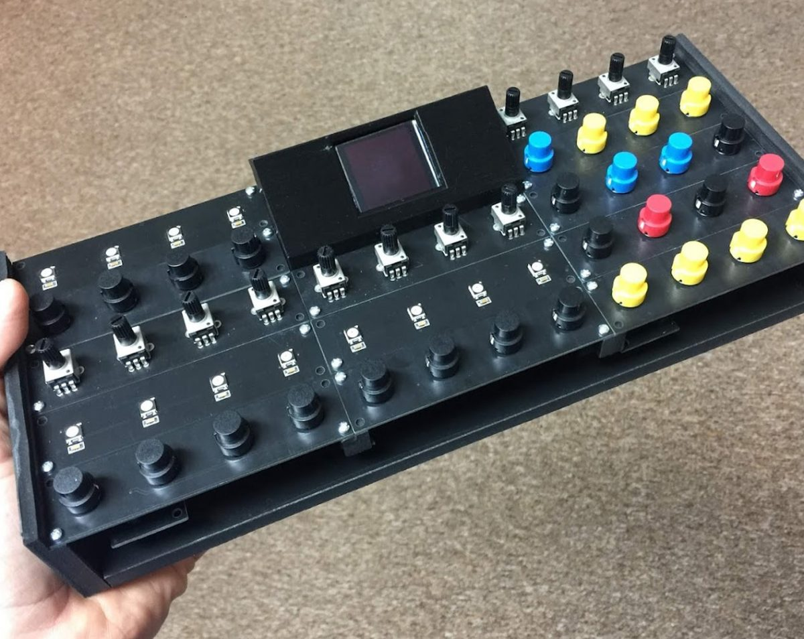
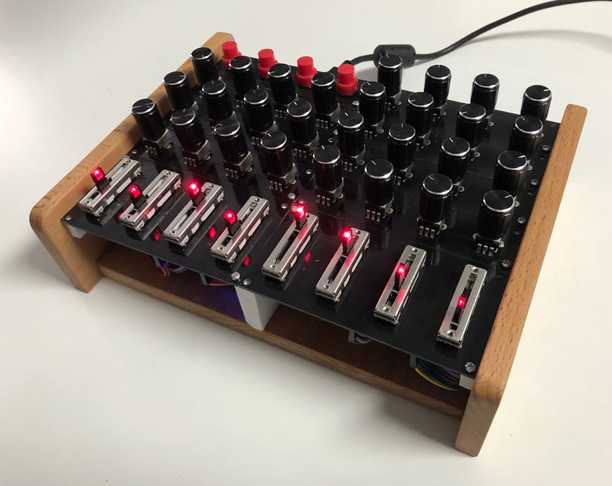
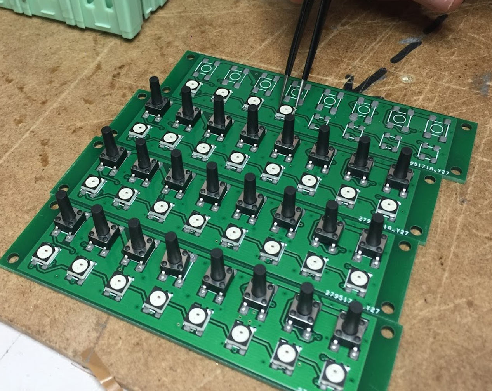
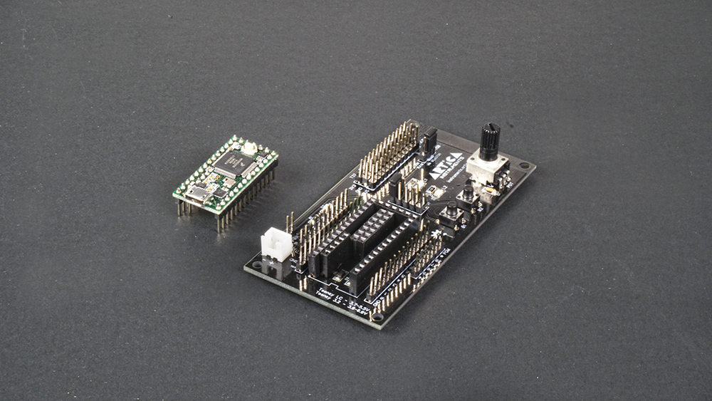
