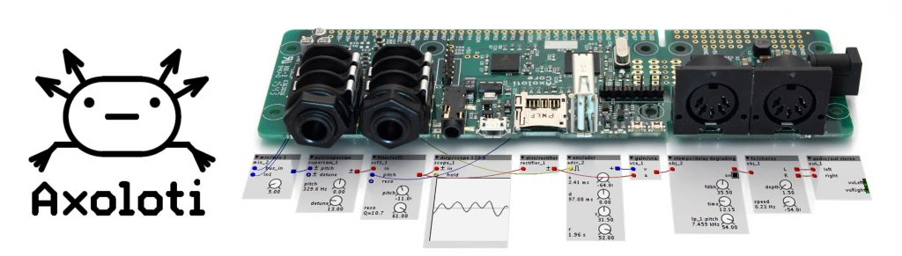
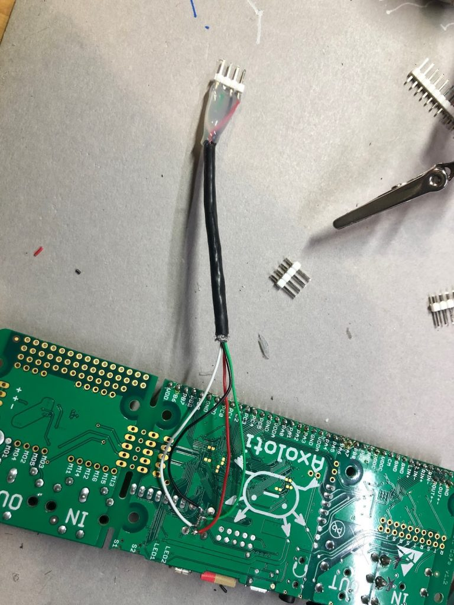

+++
title = "Drone Engine"
date = 2022-04-11
lastUpdate = 0
status = "archived"
tags = ["interactive", "music", "physicalcomputing", "research"]
featured = true
cover = "drone_engine.jpg"
showCover = false
+++

I have an [Axoloti](http://axoloti.com) core for a couple of years, I never gave good use to it. The time  finally came. I have been thinking in a Drone Machine, something that could be fun and simple to use, with a lot of ground to explore and play. On the other hand, I also want to build a generic physical setup, that allows me to change firmware and experiment with new sound objects and synth architectures.

The Axoloti Core is a bare bone pcb, built with a powerful DSP, and it is made to be hacked and customized. It has a great community, that has been creating a huge amount of amazing sonic objects since the beginning. I don't think I have invented anything, I only connected ready made objects like the oscillators and the effects, it is that simple.

This is the physical setup, it is a Teensy LC with two groups of 16 pots that are connected to multiplexers. Teensy is sending MIDI CC messages to the Axo, and all the parameters are being controlled this way. The major drawback is the MIDI low resolution (127 steps), this is noticeable in the oscillators pitch. One thing to do in the future is to connect the pitch potentiomers directly to the analog input on the Axo.  
The black PCB boards I'm using were developed during [Artica's](http://artica.cc) days. Luckilly I still have a bunch of these boards with me. 

Since the Teensy is connected to the Axo via USB (Axo has USB host port), and I didn't want to have the usb plug showing on the back panel for several reasons, the USB is soldered directly to the Axo's PCB.

If I still need to program the Teensy, I can still use a modified USB cable that connects to this JST header.

The Axoloti program is very simple, basically there's 2 oscillators based on Mutable Instruments Braids algorythms, and a third very simple oscillator. Each of the Oscillators has dedicated LFO's to the filter, and the Mutable Oscillators has also LFO to modulate color and timbre.  
Than all the voices are mixed and send to Delay and a Reverb.  
If you have an Axoloti and want to experiment this synth, you can download the patch [here](https://github.com/guibot/DRONE-ENGINE).

With a MIDI keyboard this synth can be played normally. By the time of this video I had the 3 oscillators being affected by keys, but right now only one oscillator receives MIDI information, so I can still play around with the other 2 as drone voices. 

If you want to know more about how to make a custom MIDI controller check my [tutorials about MIDI programming and generic IO processing](https://www.youtube.com/c/GuilhermeMartins/videos).



