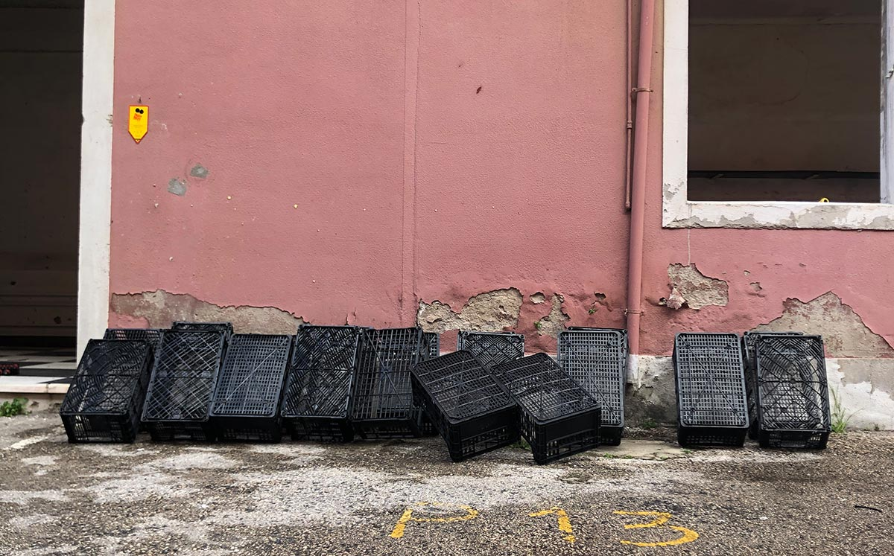
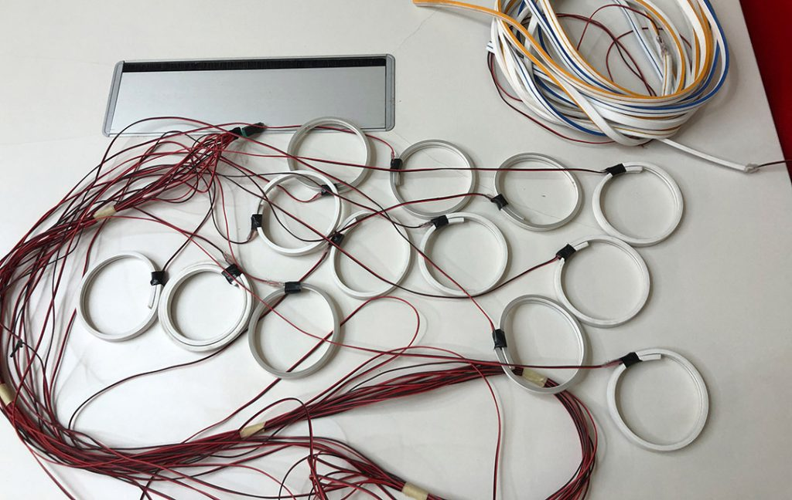
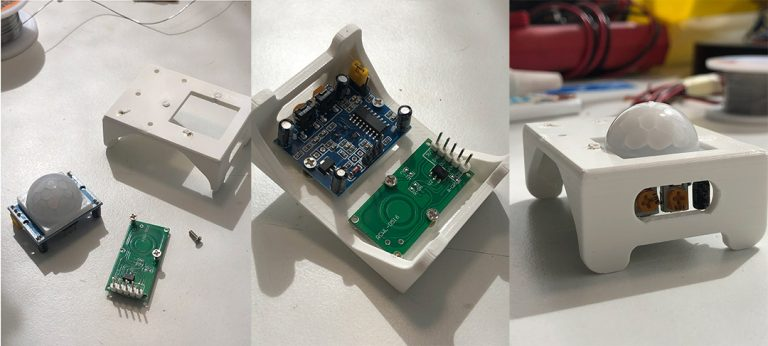

+++
title = "Dreambox"
date = 2023-04-11
lastUpdate = 0
status = "archived"
tags = ["interactive", "physicalcomputing", "research"]
featured = true
cover = "dreambox.jpg"
showCover = false
+++

Dreambox is an installation that takes me to a mental corner, where dreams, ideas, and memories reside. These mental entities have a life of their own, they can be more or less active, pulsate in synchrony or asynchrony, they can fall asleep completely leaving only one active, or even none.

This installation began with the need to decorate one of the spaces in the “Circular Corner” (Canto Circular) at Largo de Residências. The “Circular Corner” includes the “Community Cabinet” (Armário Comunitário) where you can exchange objects, and the “Community Cabinet” where you can exchange clothes, and this is where Dreambox is located.


◆
Having identified the location to intervene, I found these plastic boxes on Blab, and immediately saw their graphic and aesthetic potential.
After some tests with the lights, it was decided that this was the way to go.

.

I wanted to place the boxes on the wall in a non-obvious and somewhat deconstructed way, as if the boxes had been falling over time. I did a series of tests in Photoshop until I found a pattern that I liked.

<video
  width="840"
  controls
  preload="metadata">
  <source src="mockups.mov" type="video/mp4">
  O teu browser não suporta vídeo.
</video>

Regarding the lighting, it consists of leftovers from Neon LED strips.

The control box with all the electronics made with PVC.

<video
  width="840"
  controls
  preload="metadata">
  <source src="night_studies2_opt.mp4" type="video/mp4">
  O teu browser não suporta vídeo.
</video>

For each light, I’m using a Mosfet. These Mosfets have an LED on the board, which allowed me to simulate all the light behaviors at the lab.

Different light states / behaviours:

Heartbeat:

All lights pulse in unison, referring to the many ideas, dreams, and memories that pulse within us simultaneously — whether because we are multitasking, unfocused, overwhelmed by concerns, or simply multi-dreamers.

<video
  width="840"
  controls
  preload="metadata">
  <source src="heartbeat_h264.mp4" type="video/mp4">
  O teu browser não suporta vídeo.
</video>

Random Fade In/Out:

Similar to the heartbeat, but asynchronous. Disparate ideas, dreams, and memories competing for attention. A scattered mind or excessive mental activity.

<video
  width="840"
  controls
  preload="metadata">
  <source src="randomfades_h264.mp4" type="video/mp4">
  O teu browser não suporta vídeo.
</video>

Individual Activity:

A single active light, as if our mental focus were sharp — active awareness, a mind filled with a single thought. Mindfulness. Nirvana.

<video
  width="840"
  controls
  preload="metadata">
  <source src="unique_h264.mp4" type="video/mp4">
  O teu browser não suporta vídeo.
</video>

Esta foi a primeira instalação a solo, depois de mais de uma década a desenvolver projectos comerciais para clientes.

This was my first solo installation, after more than a decade developing commercial projects for clients.

I would like to give special thanks to Sónia Sousa (@Lady.Maker) for the invitation and challenge to take part in Canto Circular, and for believing in and trusting me with this project.
Thanks as well to the Blab Colectivo Maker crew (@blablapt) for all the help and availability, and to Largo de Residências (@largoresidencias) for supporting and encouraging these initiatives.

It is also an honour to be alongside “masya,, é uma instalação” by @m41.m, and to see how, in the end, these two works coexist and communicate so naturally with one another.

