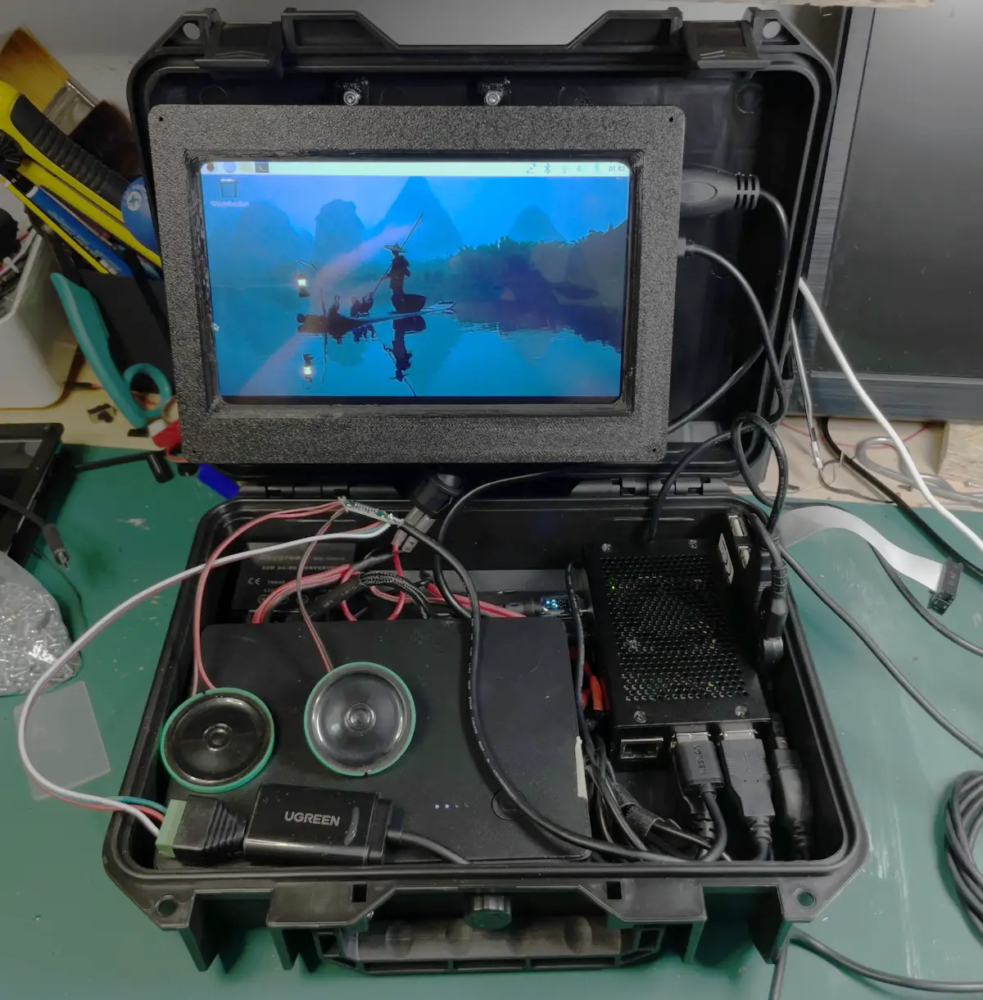

+++
title = "Cyberdeck"
date = 2025-12-22
lastUpdate = 0
status = "ongoing"
tags = ["raspberrypi", "physicalcomputing", "research", "cyberdeck"]
featured = true
cover = "cyberdeck5.webp"
showCover = true
+++

What's a [Cyberdeck](https://cyberdeck.cafe/mix/what-is-a-cyberdeck)? Maybe its best to let the experts talk:

"Like building a custom desktop tower PC a Cyberdeck is all about giving you total control over every piece that goes into your portable computing device and just like that gaming rig with all its lights, engraved panels, meticulously laid out wiring and water cooling tubes every Cyberdeck's design should be given the same consideration." from [Cyberdeck Cafe](https://cyberdeck.cafe).

I don't know where exactly I stumbled upon this concept, it was love at first sight, and my first thought was.. I want to build this thing!

Many thoughts came to my mind, the purpose, what components to use..

So, like not every of my projects, this one started with a list:

## Purpose:
Off-Grid Doomsday Computer

100% customizable, from the OS to the peripherals
SDR (software defined radio)
Meshtastic / Meshcore nodes
SSD for storage (wikipedia offline, prepping literature, tutorials, entertainment, I think this one deserves a dedicated post)

## Components:
- [Raspberry Pi 5](https://raspberrypi.com)
- SSD HD 256GB (had one laying around not being used)
- Wifi Dongle
- Bluetooth Dongle 
- [SDR - Nooelec NESDR Smart](https://www.nooelec.com/store/sdr/sdr-receivers/nesdr-smart-sdr.html)
- [Heltec v3](https://heltec.org/project/wifi-lora-32-v3/) 
- Meshtastic / Meshcore
- Battery - still working on it
- 7inch Screen
- Keyboard / Mouse
- Hard Case

My first impressions, decisions, (bad) choices?

### Power

A Raspberry Pi 5 is a great small computer, can handle most of the tasks you through at, handle multiple browser tabs, 4K video and so on. But the drawback is that it needs to have clean 5 amps, otherwise it will cut the USB current to 600 millimaps. With this said, you won't be able to use most of your peripherals (SSD, ESP32 for Meshtastic, Screen, etc).
If you have a good power source there's no problem with that, but if you are offgrid, you will have to give it the juice it needs. 

For now with the tests that was able to do I simply couldn't provide with 5 amps to the RPI. I'm waiting for a component to arrive and will write my review here.

### SDR (Software Defined Radio)

SDR Nooelec NESDR Smart, first I need to say I know nothing about radio frequencies, and wanted an SDR to learn more about it, and have fun while listening for some radio frequencies. I read really good reviews about this SDR, but so far I wasn't able to listen to nothing clear. The place where I live is really bad due to be surrounded by high buildings and I still need to take it to other places and do more testing.

### Meshtastic

About the [Meshtastic](https://meshtastic.pt) node. If you don't know what Meshtastic is, its a network made by nodes, each person has a node and more nodes in the area, more robust and resillient is the network. This is spreading all over Portugal witch is great to see. And besides this, its a really friendly community.  

### Keyboard

I have this small wireless keyboard with a mouse pad, I use it a lot in installations in an emergency, or to perform simple commands, but its annoying if one need to use it for development purposes, or intensive writting.

### 7 Inch Screen

I'm using a brand called Joy-it witch is really good, and has touch. I used another white brand and the image quality is really poor.

By this time I knew that I 'm going to need a bigger case. It will continue..