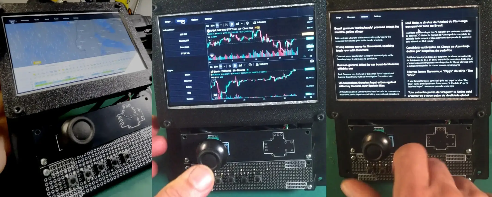
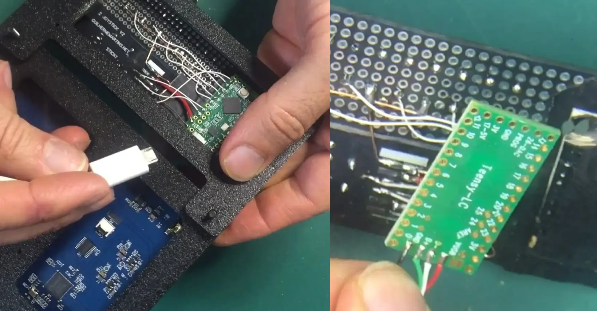
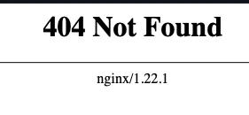

+++
title = "Daily DashBoard"
date = 2025-12-29
lastUpdate = 0
status = "ongoing"
tags = ["dashboard", "raspberrypi", "physicalcomputing", "research", "installation", "interface"]
featured = true
cover = "cover.webp"
showCover = true
+++

Daily Dashboard is a simple dashboard meant to show weather forecast, markets and news.

It's a webapp in fullscreen that runs on the browser. I had a Raspberry Pi 3, witch is a very old PI, and runs this app in the limit of its capacity, but even do, it's very capable. Maybe in the future I will upgrade it to a RPi 4.

I tought it would be nice to have some control over the information, but I didn't want to have a generic keyboard and mouse, so I added a [Teensy](https://pjrc.com) to be able to control mouse and keyboard with a joystick, and buttons.

Other thing I really like in the Teensy is the fact that it is a board meant for hardware hacking, I didn't preview the collision of the USB plug with the 3D print, so I had to strip the usb connector apart, and Teensy has the USB connections on a breakout ready to be soldered.

This is a short video explaining everything in portuguese, next videos will be in english.



There is still an issue that I don't know how to solve for now when accessing [Windy](https://www.windy.com) for the first time. It seems to be related to having a static page loading an iframe, and the browser thinks there's a page that does not exist. But it than loads the page. Other issue I had was Chrome detecting this URL as Dangerous, seems that because I'm using a page, to load other pages with iframes and embedding, this seems to be what hackers do to simulate legit pages and fraud inocent cybernauts.

You can access the Dashboard using this link:
[https://guibot.github.io/Daily_DashBoard/dashboard.html](https://guibot.github.io/Daily_DashBoard/dashboard.html)

The source code is available at [Github](https://github.com/guibot/Daily_DashBoard)

