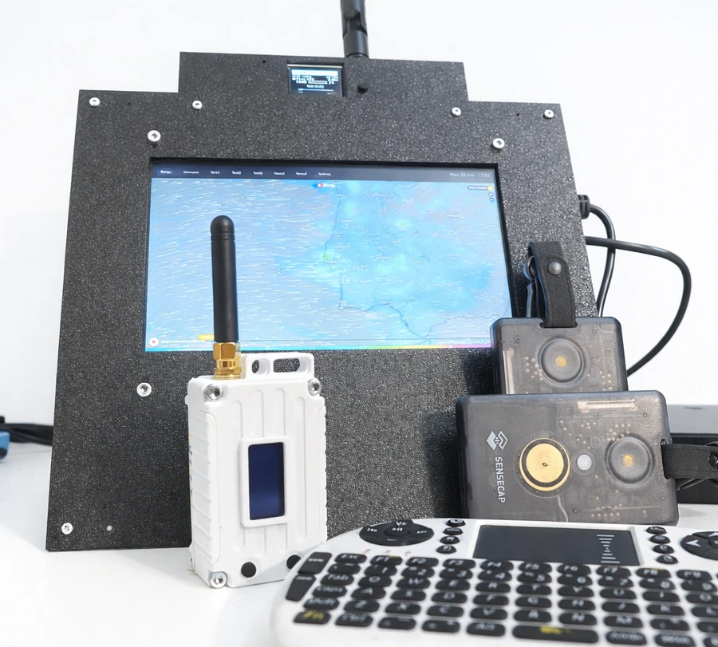
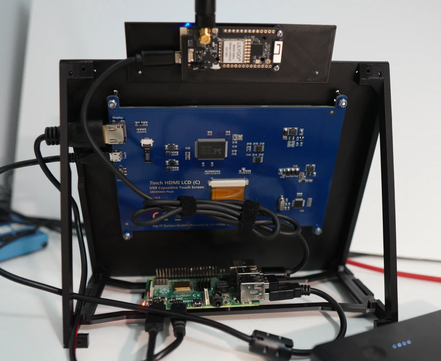
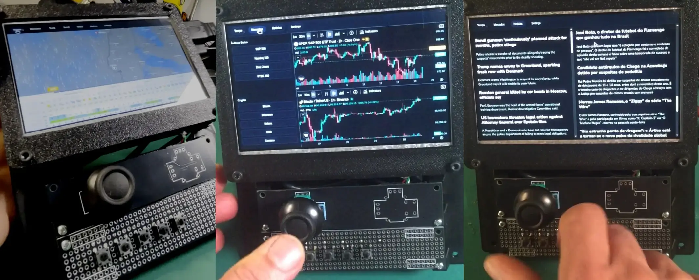
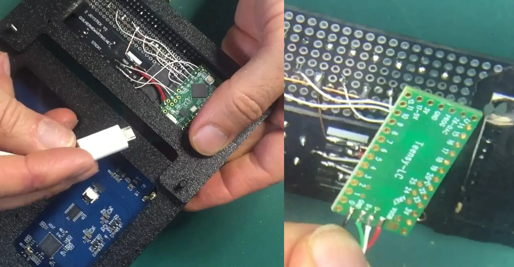
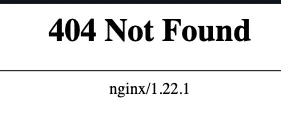

+++
title = "Daily DashBoard"
date = 2025-12-29
lastUpdate = 0
status = "ongoing"
tags = ["dashboard", "raspberrypi", "physicalcomputing", "research", "installation", "interface"]
featured = true
cover = "v2a.webp"
showCover = false
+++

## an easy way to check for weather forecast, markets, news and more.

### v2 - 2026-02-25

The PI3 was really slow, and the prototype with the Teensy was fun to build but in the end not very user friendly. 
I swapped the Pi 3 for a Pi 4. It was a major difference and what before was a pain to use, now its a breeze. 

You migh want to see how this all started in the [v1](#v1) section.

I added a [Meshtastic](https://meshtastic.org/) node, if you don't know what Meshtastic is, it is basically off grid communication. It consists in a microcontroller with a Lora Antenna, the microcontroller connects to your phone via bluetooth, and using the dedicated app, you can talk to your peers via radio signal, like a chat app. This works with a mesh principle, witch means, the more radios exist near you, the more probability your message will be delivered, more nodes, make the mesh more reliable. And with the latest blackouts, immense fires and violent storms that hitted Portugal latelly, this Mesh communication have been growing massively and a friendly community also born [Meshtastic PT](https://meshtastic.pt).

Another way of using this devices is connecting the node to the computer via usb and use a browser app. This way, I have a fixed node at home, while family members (I included) carry the mobile nodes with us, in the picture you can see a [Heltec V3](https://heltec.org/project/wifi-lora-32-v3/) and [SeeedStudio Sensecap T-1000 Tracker](https://www.seeedstudio.com/SenseCAP-Card-Tracker-T1000-E-for-Meshtastic-p-5913.html).

### v1 - How it all started - 2025-12-29

I've been thinking in having a dashboard to see weather forecast, and than since I already had a dashboard more ideas arised: news, markets. 
It consists on a webapp that runs on the browser. I had a Raspberry Pi 3, witch is a very old PI, and runs this app in the limit of its capacity, but even do, it's very capable. Maybe in the future I will upgrade it to a RPi 4.

I tought it would be nice to have some control over the information, but I didn't want to have a generic keyboard and mouse, so I added a [Teensy](https://pjrc.com) to be able to control mouse and keyboard with a joystick, and buttons.

Other thing I really like in the Teensy is the fact that it is a board meant for hardware hacking, I didn't preview the collision of the USB plug with the 3D print, so I had to strip the usb connector apart, and Teensy has the USB connections on a breakout ready to be soldered.

This is a short video explaining everything in portuguese, next videos will be in english.



There is still an issue that I don't know how to solve for now when accessing [Windy](https://www.windy.com) for the first time. It seems to be related to having a static page loading an iframe, and the browser thinks there's a page that does not exist. But it than loads the page. Other issue I had was Chrome detecting this URL as Dangerous, seems that because I'm using a page, to load other pages with iframes and embedding, this seems to be what hackers do to simulate legit pages and fraud inocent cybernauts.

You can access the Dashboard using this link:
[https://guibot.github.io/Daily_DashBoard/dashboard.html](https://guibot.github.io/Daily_DashBoard/dashboard.html)

The source code is available at [Github](https://github.com/guibot/Daily_DashBoard)

