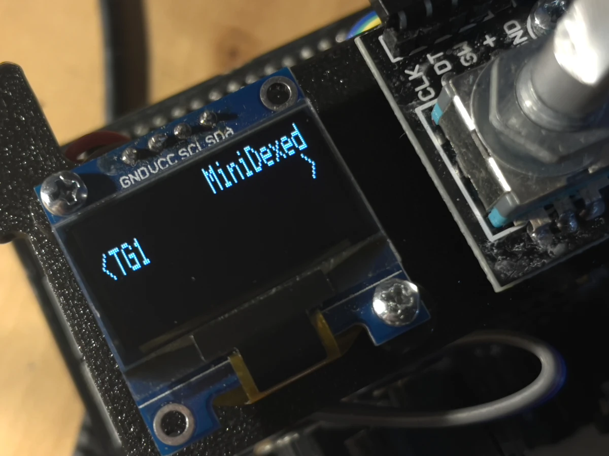
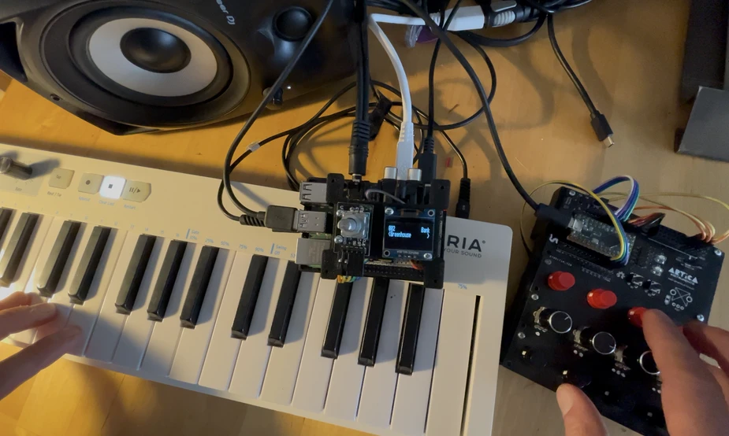
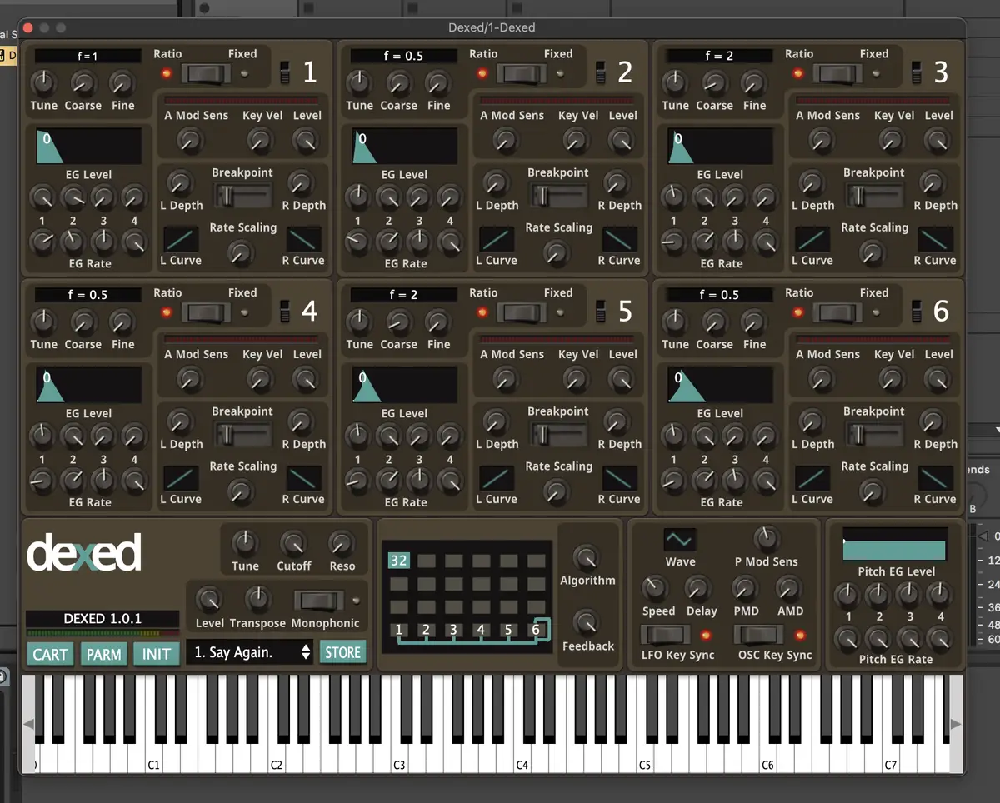

+++
title = "Mini Dexed"
date = 2026-01-10
lastUpdate = 0
status = "ongoing"
tags = ["instrument", "raspberrypi", "physicalcomputing", "research", "midi"]
featured = true
cover = "cover2.webp"
showCover = false
+++

Mini Dexed is a synthesizer emulator of the legendary Yamaha DX7. In this case, Mini Dexed has 8 instances of the DX7 simoultaneously. It runs on a [Raspberry Pi 4](https://www.raspberrypi.com/) - bare metal - what this means is, it doesn't run on Linux, it runs directly on the first computing layer of the CPU -> low latency, high DSP quality. 



Each instance of the DX7 is called a Tone Generator - TG. The TG has plenty of features to manipulate and modulate the sound produced by the synth, and believe me, this thing is a monster. What you see in the structure below, is just for one Tone Generator, there are 7 more.

```text
MiniDexed
├── TGn
│   ├── Voice
│   ├── Bank
│   ├── Volume
│   ├── Pan
│   ├── Reverb-Send
│   ├── Detune
│   ├── Cutoff
│   ├── Resonance
│   ├── Unison
│   │   ├── Voices
│   │   ├── Detune
│   │   └── Spread
│   ├── Pitch Bend
│   │   ├── Bend Range
│   │   └── Bend Step
│   ├── Portamento
│   │   ├── Mode
│   │   ├── Glissando
│   │   └── Time
│   ├── Poly/Mono
│   ├── Modulation
│   │   ├── Mod. Wheel
│   │   │   ├── Range
│   │   │   ├── Pitch
│   │   │   ├── Amplitude
│   │   │   └── EG Bias
│   │   ├── Foot Control
│   │   │   ├── Range
│   │   │   ├── Pitch
│   │   │   ├── Amplitude
│   │   │   └── EG Bias
│   │   ├── Breath Control
│   │   │   ├── Range
│   │   │   ├── Pitch
│   │   │   ├── Amplitude
│   │   │   └── EG Bias
│   │   └── Aftertouch
│   │       ├── Range
│   │       ├── Pitch
│   │       ├── Amplitude
│   │       └── EG Bias
│   ├── Channel
│   └── Edit Voice
│       ├── OPn
│       │   ├── Output Level
│       │   ├── Freq Coarse
│       │   ├── Freq Fine
│       │   ├── Osc Detune
│       │   ├── Osc Mode
│       │   ├── EG Rate 1
│       │   ├── EG Rate 2
│       │   ├── EG Rate 3
│       │   ├── EG Rate 4
│       │   ├── EG Level 1
│       │   ├── EG Level 2
│       │   ├── EG Level 3
│       │   ├── EG Level 4
│       │   ├── Break Point
│       │   ├── L Key Depth
│       │   ├── R Key Depth
│       │   ├── L Key Scale
│       │   ├── R Key Scale
│       │   ├── Rate Scaling
│       │   ├── A Mod Sens.
│       │   ├── K Vel. Sens.
│       │   └── Enable
│       ├── Algorithm
│       ├── Feedback
│       ├── P EG Rate 1
│       ├── P EG Rate 2
│       ├── P EG Rate 3
│       ├── P EG Rate 4
│       ├── P EG Level 1
│       ├── P EG Level 2
│       ├── P EG Level 3
│       ├── P EG Level 4
│       ├── Osc Key Sync
│       ├── LFO Speed
│       ├── LFO Delay
│       ├── LFO PMD
│       ├── LFO AMD
│       ├── LFO Sync
│       ├── LFO Wave
│       ├── P Mod Sens.
│       ├── Transpose
│       └── Name
├── Effects
│   ├── Compress
│   └── Reverb
│       ├── Enable
│       ├── Size
│       ├── High damp
│       ├── Low damp
│       ├── Low pass
│       ├── Diffusion
│       └── Level
├── Master Volume
└── Performance
    ├── Load
    ├── Save
    │   ├── Overwrite
    │   ├── New
    │   └── Save as default
    ├── Delete
    ├── Bank
    └── PCCH
```
<span style="color:var(--bg)">◆</span>

The original repository of this project has an encoder and a LCD screen, which luckily I had laying around. But I imagined that using only one encoder to navigate through such a deep menu would be a struggle, and I also thought I would be using the menu a lot, what did I knew at the time!


Because of this, I added a [Teensy](https://pjrc.com) to be able to navigate through the menu with MIDI CC messages. And Teensy has MIDI-USB straight out of the box. I also added potenciometers to be able to control Cutoff, Resonance and Reverb level.





<span style="color:var(--bg)">◆</span>


### Update 2026-01-30

I wanted to have a physical interface that allowed me to have more possibilities to control this synth. 
Besides CutOff and Ressonance, set Sustain and Sustenuto, I thought I would be able to control more features. I didn't know exactly what the MiniDexed was, until I dived deeper into the tree structure as seen on Part 1. And if you want to program this beast and make your own synths, be prepared to master FM Synthesis.

Only after building this physical controller, that I started to understand that this synth is not meant to be controlled like a normal synth, you have all the parameters available, but they are not meant to be controllable in real time like a "normal synth". Other small detail I noticed, if you want to program your own DX7 voice, you need to master FM synthesis for real.

That's where [Dexed](https://asb2m10.github.io/dexed/) comes in. It's a VST plugin, where you can program your own DX7 patch, and save it as sysex (System Exclusive), and load the patch on a DX7, or any DX7 emulator.



Imagine having 8 instances of this synth, playing in simultaneously.

This is making me re-think the purpose of this instrument, I came to the conclusion that I prefer to just enjoy the great sounds that already exist, instead of entering the rabbit hole of deep FM Synthesis, that probably will lead me to nothing.

For now I'm just enjoying the piano soundings.



