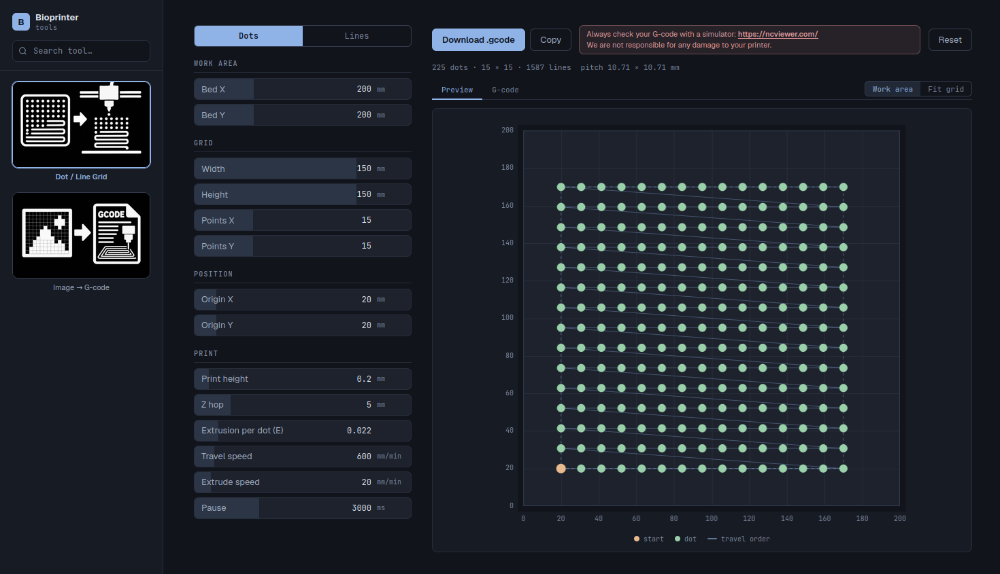
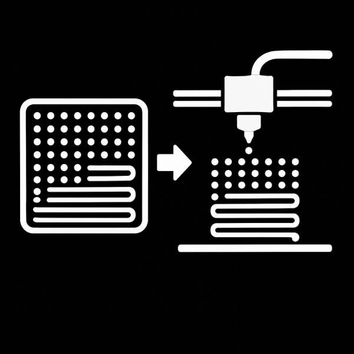
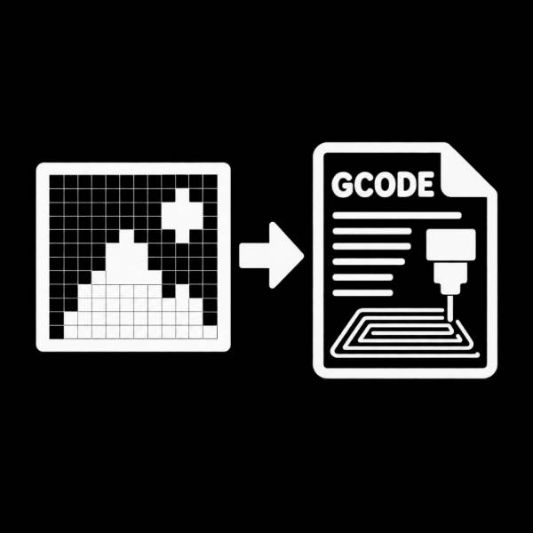
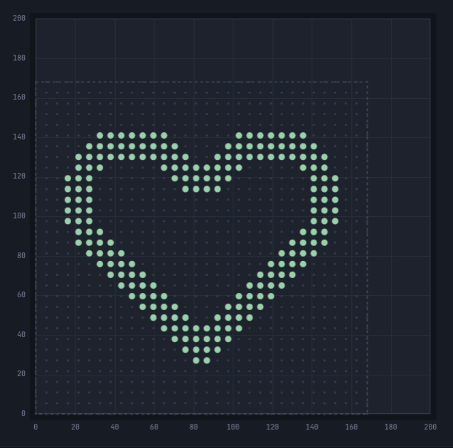
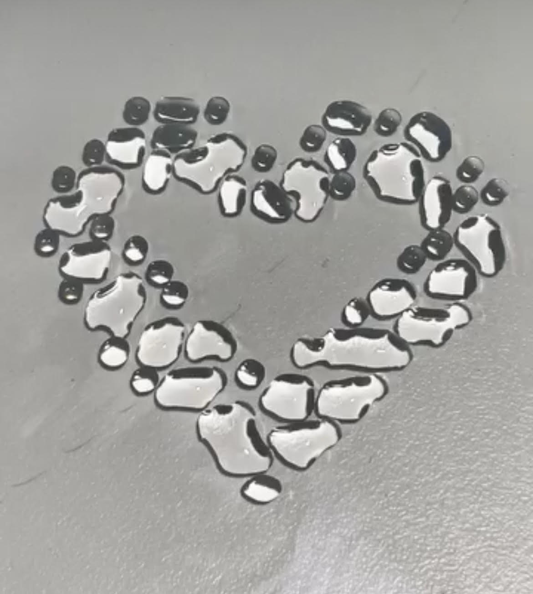

+++
title = "Bioprinter Tools"
date = 2026-09-28
lastUpdate = 0
status = "ongoing"
tags = ["bioprinting", "vibecode"]
featured = true
cover = "Bioprinter_tools.png"
showCover = false
+++

## browser-based G-code generators for extrusion bioprinters.

Pick a tool, tweak the parameters, check the toolpath on a preview, and download the G-code. No install and no build step, everything runs in your browser.

[Try it live](https://guibot.github.io/Bioprint-Tools/) · [Source on GitHub](https://github.com/guibot/Bioprint-Tools)

### Tools

**Dot / Line Grid**  
Prints a grid either as discrete dots (Z-hop and dwell per dot) or as lines (horizontal and vertical strokes, multiple layers). Both modes share the same grid box, position and work area.

**Image → G-code**  
Turns an image into a toolpath placed on a work-area preview. Modes: dots, crosshatch, spiral, raster, contour and scaffold (multilayer woodpile with alternating angles).

Numeric fields work like sliders, the G-code and preview regenerate on every change, and invalid values show an error instead of producing broken G-code.

### Heart

A toolpath preview of a heart, and the same heart drawn with dispensed droplets.

> Always check your G-code with a simulator such as [NC Viewer](https://ncviewer.com/) before printing. Generated G-code must be reviewed against your own machine before use.
