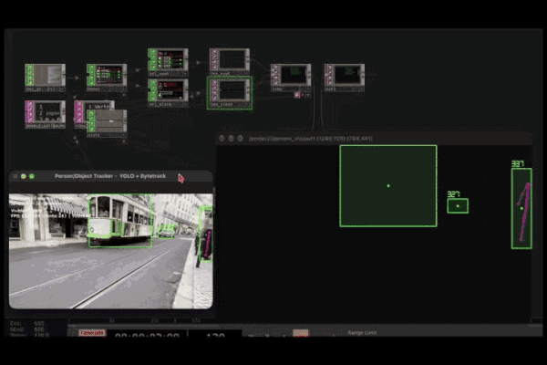

+++
title = "YOLO Tracking → TouchDesigner"
date = 2026-10-07
lastUpdate = 0
status = "ongoing"
tags = ["touchdesigner", "computer vision", "osc", "vibecode"]
featured = true
cover = "yolo_td_preview_600x400.gif"
showCover = false
+++

## real-time object and person tracking from a webcam, sent over OSC.

A small Python app that runs YOLOv8 + ByteTrack on a webcam or a looping video, and streams the results over OSC. Built to feed TouchDesigner, but it works with anything that speaks OSC.

[Source on GitHub](https://github.com/guibot/YOLO-OSC)

### What it does

- Detects and tracks with persistent IDs (ByteTrack).
- Per-target state: moving (green) or stopped (red).
- Marker with class and ID, e.g. `person ID 3`.
- Optional pose skeleton, sent per keypoint.
- Live FPS limit and resolution switching (default 24 FPS, 1280x720).
- Source and classifier selection panels on startup.

### Classifiers

Any of the 80 COCO classes can be switched on or off in the selector panel. Person is the default.

 

### OSC

Default destination `127.0.0.1:9000`, normalized 0..1.

| Address | Value |
|---------|-------|
| `/target/<id>/class` | class name |
| `/target/<id>/x`, `/y` | center |
| `/target/<id>/w`, `/h` | size |
| `/target/<id>/state` | 1 moving, 0 stopped |
| `/lost` | ID of a target that disappeared |
| `/skeleton/<id>/<keypoint>` | x, y, confidence |

 

Install and usage details are in the [repo](https://github.com/guibot/YOLO-OSC). Tested on macOS. Detection powered by [Ultralytics YOLO](https://github.com/ultralytics/ultralytics). Orchestrated by me, built with Claude Code.
